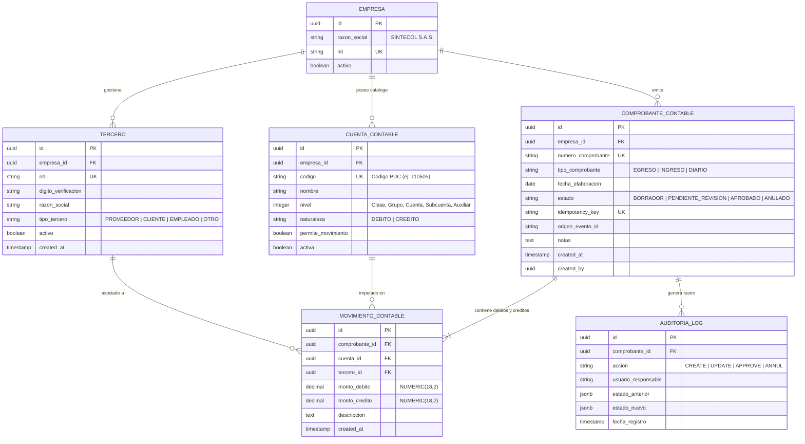

# Contrato de API: Registro y Clasificación de Transacciones Contables

- **Organización:** SINTECOL S.A.S.
- **Módulo:** Core Contable / Bot de Clasificación
- **Versión de API:** v1
- **Estado:** Propuesta de Arquitectura (Pendiente de Aprobación)

---

## 1. Definición del Endpoint

- **Método HTTP:** `POST`
- **Ruta:** `/api/v1/transacciones`
- **Content-Type:** `application/json`
- **Autenticación:** Sesión basada en JWT (transmitido vía Cookie `HttpOnly` / `Secure` o Header `Authorization: Bearer <token>`).
- **Control de Idempotencia:** Header obligatorio `X-Idempotency-Key` (UUIDv4) para prevenir transacciones duplicadas por reintentos de red o envíos múltiples.

---

## 2. Esquema Estricto del Request (Payload JSON)

### 2.1 Especificación de Campos

| Campo | Tipo | Requerido | Restricciones / Formato | Descripción |
| :--- | :--- | :--- | :--- | :--- |
| `monto` | `string` | Sí | Regex: `^[0-9]+(\.[0-9]{2})?$`, Valor > 0. Se prohíbe float binario IEEE 754; formato string decimal estricto para evitar pérdida de precisión monetaria. | Valor monetario de la transacción en COP. |
| `tipo` | `string` | Sí | Enum: `DEBITO`, `CREDITO`. | Naturaleza contable o movimiento individual a registrar. |
| `nit` | `string` | Sí | Regex: `^[0-9]{8,10}(-[0-9kK])?$`. Longitud: 8 a 12 caracteres. Validación obligatoria de Dígito de Verificación (DV) DIAN (Módulo 11). | Identificación tributaria del tercero/proveedor/cliente. |
| `cuenta` | `string` | Sí | Regex: `^[1-9][0-9]{3,9}$` (4 a 10 dígitos numéricos según PUC colombiano). Solo cuentas auxiliares que permitan movimiento. | Código de cuenta contable del PUC. |
| `fecha` | `string` | Sí | Formato ISO 8601 UTC: `YYYY-MM-DDTHH:mm:ssZ` o `YYYY-MM-DD`. No puede ser superior a la fecha actual ni pertenecer a un periodo contable cerrado. | Fecha de causación o devengo de la transacción. |
| `descripcion` | `string` | No | Longitud: 5 a 255 caracteres, sanitizado (sin etiquetas HTML ni secuencias de escape no permitidas). | Detalle o concepto de la transacción. |
| `origen_evento_id` | `string` | No | Formato UUIDv4. | Identificador único del evento ingestor (ej. ID de mensaje del Bot / Comprobante externo). |

### 2.2 JSON Schema (Draft-07)

```json
{
  "$schema": "http://json-schema.org/draft-07/schema#",
  "title": "RegistroTransaccionRequest",
  "type": "object",
  "properties": {
    "monto": {
      "type": "string",
      "pattern": "^[0-9]+(\\.[0-9]{2})?$",
      "description": "Monto en formato decimal estricto para evitar imprecisiones de punto flotante"
    },
    "tipo": {
      "type": "string",
      "enum": ["DEBITO", "CREDITO"],
      "description": "Naturaleza contable del movimiento"
    },
    "nit": {
      "type": "string",
      "pattern": "^[0-9]{8,10}(-[0-9kK])?$",
      "description": "NIT del tercero con o sin dígito de verificación"
    },
    "cuenta": {
      "type": "string",
      "pattern": "^[1-9][0-9]{3,9}$",
      "description": "Código de cuenta contable PUC (mínimo nivel auxiliar)"
    },
    "fecha": {
      "type": "string",
      "format": "date-time",
      "description": "Fecha y hora en estándar ISO 8601 UTC"
    },
    "descripcion": {
      "type": "string",
      "minLength": 3,
      "maxLength": 255
    },
    "origen_evento_id": {
      "type": "string",
      "format": "uuid"
    }
  },
  "required": ["monto", "tipo", "nit", "cuenta", "fecha"],
  "additionalProperties": false
}
```

---

## 3. Esquemas de Response

### 3.1 Respuesta Exitosa (HTTP 201 Created)

Retornada cuando la transacción ha sido validada y registrada en el comprobante o borrador contable.

```json
{
  "status": "success",
  "data": {
    "id": "e8b62bf2-4161-482a-a9e3-2e0fbb38a101",
    "numero_comprobante": "COM-2026-000412",
    "monto": "1500000.00",
    "tipo": "DEBITO",
    "nit": "900123456-1",
    "tercero_razon_social": "PROVEEDOR EJEMPLO S.A.S.",
    "cuenta": "513505",
    "cuenta_nombre": "Servicios de Aseo y Cafetería",
    "fecha": "2026-09-19T23:30:00Z",
    "estado": "CLASIFICADO_PENDIENTE_APROBACION",
    "origen_evento_id": "8fa81699-2a74-4b53-a75d-5953049195d2",
    "idempotency_key": "c1f6b8df-5949-4eb5-8e10-928e1dc4a67b",
    "created_at": "2026-09-19T23:31:00Z",
    "empresa": "SINTECOL S.A.S."
  }
}
```

### 3.2 Respuestas de Error

#### A. Error de Validación / Regla de Negocio (HTTP 400 Bad Request)
Alineado con RFC 7807 (Problem Details for HTTP APIs). No expone stack traces ni detalles internos del motor.

```json
{
  "type": "https://api.sintecol.com/errors/validation-error",
  "title": "Error de Validación de Datos Contables",
  "status": 400,
  "detail": "El payload contiene uno o más campos inválidos o contrarios a las normas contables.",
  "instance": "/api/v1/transacciones",
  "code": "CONTABLE_VALIDATION_FAILED",
  "errors": [
    {
      "field": "nit",
      "rejected_value": "900123456-9",
      "message": "Dígito de verificación inválido según algoritmo Módulo 11 DIAN."
    },
    {
      "field": "cuenta",
      "rejected_value": "999999",
      "message": "La cuenta contable no existe en el catálogo PUC activo o no admite movimiento directo."
    }
  ]
}
```

#### B. Conflicto de Idempotencia / Duplicidad (HTTP 409 Conflict)

```json
{
  "type": "https://api.sintecol.com/errors/idempotency-conflict",
  "title": "Transacción Duplicada",
  "status": 409,
  "detail": "La transacción con la clave de idempotencia suministrada ya fue procesada previamente.",
  "instance": "/api/v1/transacciones",
  "code": "DUPLICATE_TRANSACTION_REJECTED"
}
```

#### C. Error Interno del Servidor (HTTP 500 Internal Server Error)
Zero-Trust: Se ofuscan detalles del motor de base de datos o stack trace; se devuelve un identificador de seguimiento (`correlation_id`).

```json
{
  "type": "https://api.sintecol.com/errors/internal-server-error",
  "title": "Error Interno del Servicio",
  "status": 500,
  "detail": "Ha ocurrido un error inesperado al procesar el registro contable. Contacte al administrador con el correlation_id.",
  "instance": "/api/v1/transacciones",
  "code": "INTERNAL_SERVER_ERROR",
  "correlation_id": "f83a45c2-b13e-4d22-8356-91823bb19a4e"
}
```

---

## 4. Modelo Entidad-Relación Preliminar (Base de Datos)

### 4.1 Diagrama ER



### 4.2 Restricciones de Integridad y Reglas de Base de Datos

1. **Principio de Partida Doble:** En todo `COMPROBANTE_CONTABLE` finalizado, `SUM(monto_debito) == SUM(monto_credito)`. Si el endpoint procesa transacciones aisladas, estas deben consolidarse en estado `BORRADOR` o `PENDIENTE_REVISION` hasta balancear la contrapartida.
2. **Imputación a Cuentas Auxiliares:** Los movimientos contables solo pueden imputarse a cuentas donde `permite_movimiento = TRUE` (cuentas auxiliares del PUC de 6 u 8 dígitos).
3. **Inmutabilidad y No Eliminación:** Prohibido el `DELETE` físico en tablas contables (`COMPROBANTE_CONTABLE` y `MOVIMIENTO_CONTABLE`). Todo ajuste se realiza mediante notas de anulación o comprobantes de corrección.
4. **Tipos Monetarios:** Usar `NUMERIC(18, 2)` o `DECIMAL(18, 2)` a nivel de base de datos para prevenir pérdida de precisión por redondeo en operaciones financieras y tributarias.
